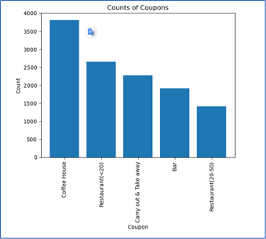

# Customer’s behavior anslysis

## About Data set
The data set used in this analysis is sourced from the UCI Machine Learning repository and was gathered through a survey conducted on Amazon Mechanical Turk. The survey focused on various driving scenarios, encompassing factors such as the destination, current time, weather conditions, presence of passengers, and more. Participants were asked whether they would accept a coupon if they were the driver in each given scenario. Responses indicating an immediate or near-future acceptance of the coupon were labeled as 'Y = 1', while answers expressing disinterest in the coupon were labeled as 'Y = 0'.

The survey encompassed five distinct types of coupons, including those applicable to affordable restaurants (under $20), coffee houses, carry out & take away establishments, bars, and more expensive restaurants ($20 - $50).

## Context
* The survey scenario entailed driving through town and receiving a coupon on one's cell phone for a restaurant nearby.
* Factors such as accepting the coupon and taking a short detour, accepting the coupon but using it on a subsequent trip, or completely disregarding the coupon were considered.
* The type of establishment, whether a restaurant or a bar, was also examined in terms of acceptance rates.
* Additionally, the presence of a minor passenger or only the driver and their partner in the car, as well as the impact of weather conditions and time of day, were considered.
* Proximity to the business was acknowledged as a key factor in coupon delivery, but the study aimed to identify the determining factors influencing a driver's acceptance of the coupon once it was received.
* The analysis sought to establish methods for predicting a driver's likelihood of accepting a coupon based on various factors.

## Goal
The goal of this project is to analyze customer’s behavior to accept or not to accept different kinds of coupons.

## Jupyter notebook
[Notebook](m_ass_m5.ipynb)

## Content
The dataset consists of 26 columns and 12,684 rows. The majority of rows, nearly all of them, have 12,684 non-null values. However, there are some exceptions where certain rows have fewer non-null values. In particular, the "car" column has only 108 non-null rows. Similarly, the columns 'CoffeeHouse', 'Restaurant20To50', 'Bar','CarryAway', 'RestaurantLessThan20', and 'Restaurant20To50' have more than 12,000 but less than 12,684 rows with non-null values.

In this step, we eliminate all rows that contain missing values in the following columns: 'CoffeeHouse', 'Restaurant20To50', 'Bar', 'CarryAway', 'RestaurantLessThan20', and 'Restaurant20To50'. Additionally, for the 'car' column, we replace any missing values with the value 'No info'. After cleaning the dataset by dropping rows with missing values, we now have a cleaned dataset with 12,079 rows. All of these rows have non-null values, ensuring that the dataset is now complete and free from missing data.

The acceptance rate for the coupon is significantly high, with approximately 56.93% of the total observations choosing to accept it.  
We are using a bar plot to visualize the ‘coupon’ column.  
  

In the Amazon data set of coupons, the Coffee House's coupons stand out as the largest, with nearly 4000 offers available. Following that, there are over 2500 coupons for restaurants with a ticket size of less than USD 20 per person. Carry out and take away coupons account for 2300 offers, while bar coupons are close behind with almost 2000 available. Lastly, there are approximately 1500 coupons for restaurants with a ticket size ranging from USD 20 to 50 per person.  
We used a histogram to visualize the ‘temperature’ column.  
  

Research is being conducted on the relationship between coupon acceptance and temperature. The study found that approximately 50% of cases, totaling more than 6000 instances, occur at a temperature of 80 degrees Fahrenheit. Around 30% or 4000 cases were observed at 60 degrees Fahrenheit, while more than 2000 cases, accounting for approximately 17%, were recorded at 30 degrees Fahrenheit.

## Investigating the Bar coupon
The acceptance rate for the bar coupon is 41.19 % which is much lower than 56.93% - the acceptance rate for all kinds of coupon.The acceptance rate for drivers who visited a bar more than 3 times a month is 76.16%, which is twice the acceptance rate of those who visited a bar 3 or fewer times a month, which stands at 37.26%.

Type 1 drivers who visit a bar more than once a month and are over the age of 25 have a significantly high acceptance rate of 68.98%. This rate is 2.33 times higher than the overall acceptance rate of all other drivers, indicating that type 2 drivers who visit a bar less than once a month have a much lower acceptance rate of only 29.53%.

The acceptance rate for type 3 drivers who visit bars more than once a month, with passengers who are not children and have occupations other than farming, fishing, or forestry, is 43.49%. It is 1.5 times higher than the acceptance rate of type 2 drivers who visit bars less than once a month, which is only 29.53%.

Although this rate is lower than the acceptance rate of type 1 drivers who are over the age of 25 and visit bars more than once a month, which is 68.98%.

In the next step, we compare the acceptance rates (AR) among three groups of drivers:

* Type 4: Drivers who visit bars more than once a month, have passengers who are not children, and are not widowed.
* Type 5: Drivers who visit bars more than once a month and are under the age of 30.
* Type 6: Drivers who visit cheap restaurants more than 4 times a month and have an income less than 50K.

The acceptance rate for Type 4 drivers is 70.94%, which is almost equal to the acceptance rate of Type 5 drivers at 71.95%. Both of these rates are much higher than the acceptance rate of Type 6 drivers, which is only 46.15% and 1.5 times lower.

Type 4 and Type 5 drivers share similarities with Type 1 drivers, who are over the age of 25 and have an acceptance rate of 68.98%.

The key factor to consider is age, as it helps identify a good segment for bar coupons, which includes drivers who visit bars more than once a month and are between the ages of 25 and 30.

In conclusion, the optimal target segment for the Bar coupon is drivers who visit Bars more than once a month and are under the age of 30. This segment has an acceptance rate of 71.95%.

## Independent Investigation - Investigating the Coffee House coupon
The acceptance rate of the Coffee House coupon is 49.63%, which is below the acceptance rate of all types of coupons at 56.93%, but higher than the acceptance rate of the bar coupon at 41.19%.

The acceptance rate for drivers who visited a Coffee House more than three times a month is 67.25%, which is 1.5 times higher than the acceptance rate for those who visited a Coffee House three or fewer times a month, standing at 44.59%

Type 1 drivers who visit a Coffee House more than once a month and are over the age of 25 have a significantly high acceptance rate of 63.95%. This rate is 1.87 times higher than the overall acceptance rate of all other drivers, indicating that type 2 drivers who visit a Coffee House less than once a month have a much lower acceptance rate of only 34.03%.

The acceptance rate for type 3 drivers who visit Coffee House more than once a month, with passengers who are not kids and have occupation student, is 48.08%. It is 1.41 times higher than the acceptance rate of type 2 drivers who visit Coffee House less than once a month, which is only 34.03%.
Although this rate is lower than the acceptance rate of type 1 drivers who are over the age of 25 and visit Coffee House more than once a month, which is 63.95%. 

In the next step, we compare the acceptance rates (AR) among three groups of drivers:
* Type 4: Drivers who visit Coffee Houses more than once a month, have passengers who are not children, and have student occupation.
* Type 5: Drivers who visit Coffee Houses more than once a month and are under the age of 30.
* Type 6: Drivers who visit restaurants($20-$50 per person) more than 4 times a month and have an income less than 50K.
* Type 7: Drivers who visit  cheap restaurants(less than $20 per person) more than 4 times a month and have an income less than 50K.

The acceptance rate for Type 4 drivers is 67.7%, which is nearly identical to the acceptance rate of Type 5 drivers at 68.6%. Both of these rates are slightly higher than the acceptance rate for Type 6 drivers, which stands at 63.9%.
On the other hand, the acceptance rate for Type 7 drivers is 54.23%, which is 15% lower than the acceptance rate of Type 6 drivers, 21% lower than the acceptance rate of Type 5 drivers, and 19.9% lower than the acceptance rate of Type 4 drivers.

In conclusion, the optimal target segment for the Coffee House coupon is drivers who visit Coffee Houses more than once a month and are under the age of 30. This segment has an acceptance rate of 68.6%.
